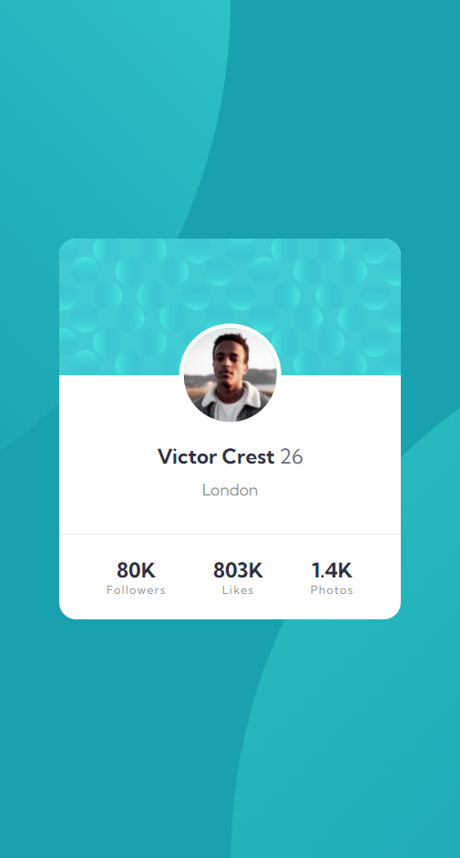

# Frontend Mentor - Profile card component solution

This is a solution to the [Profile card component challenge on Frontend Mentor](https://www.frontendmentor.io/challenges/profile-card-component-cfArpWshJ). Frontend Mentor challenges help you improve your coding skills by building realistic projects. 

## Table of contents

- [Overview](#overview)
  - [The challenge](#the-challenge)
  - [Screenshot](#screenshot)
  - [Links](#links)
- [My process](#my-process)
  - [What I learned](#what-i-learned)
- [Author](#author)

## Overview

### The challenge

- Build out the project to the designs provided

### Screenshot

### Links

- Solution URL: [https://github.com/lcabrera13/profile-card-component-solution](https://github.com/lcabrera13/profile-card-component-solution)
- Live Site URL: [https://profile-card-component-solution-theta.vercel.app/](https://profile-card-component-solution-theta.vercel.app/)

## My process

### What I learned

In this project I learned how to use background patterns.

## Author

- Website - [Luis Cabrera](https://lcabrera13.github.io/)
- Frontend Mentor - [@lcabrera13](https://www.frontendmentor.io/profile/lcabrera13)
- GitHub - [@lcabrera13](https://github.com/lcabrera13)
